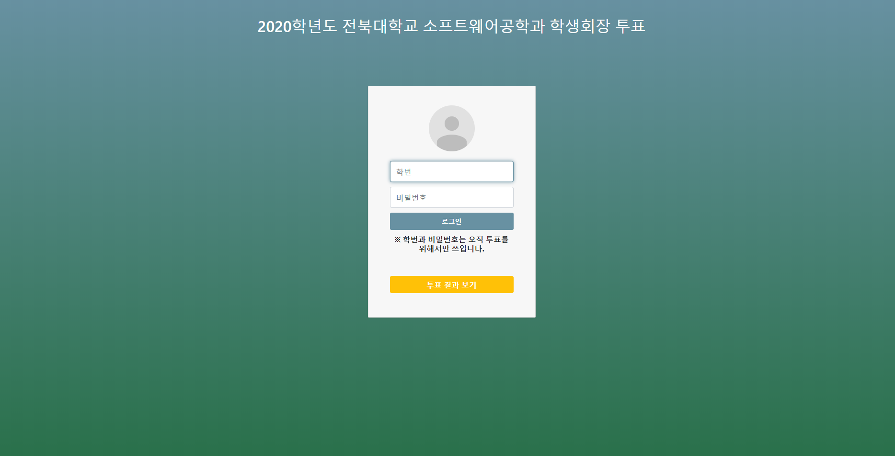

# JBNU-SE-Voting

> 전북대학교 소프트웨어공학과 온라인 투표 시스템

[![Contributors][contributors-shield]][contributors-url]
[![Forks][forks-shield]][forks-url]
[![Stargazers][stars-shield]][stars-url]
[![Issues][issues-shield]][issues-url]
[![MIT License][license-shield]][license-url]

코로나 19로 인해 실제 학과 내에서 온라인 기밀 투표를 하기 위해 개발한 전북대학교 소프트웨어공학과의 온라인 투표 서비스이며, 다른 타겟층 서비스에도 응용할 수 있습니다.
인증을 위해 특정 로그인 api를 사용했으나 보안상의 이유로 코드에서 삭제했습니다.1



[View Site - 투표 종료](http://ampm.jbnu.ac.kr/jbnu-se-voting)

## Tech Usage

* Bootstrap 4
* Node 12.16.1
* Mongo DB 4.2.3 (Mongoose ^5.9.4)

## Start

> 배포 환경에 secret 디렉토리가 존재해야 합니다.

1. Check and delete existing Docker image
```sh
sudo docker images
sudo docker rmi [Image ID]
```

2. Check and delete existing Docker container
```sh
sudo docker ps -a
sudo docker rm [container ID]
```

3. Download new image from [Docker Hub](https://hub.docker.com/r/ampmjbnu/jbnu-se-voting/tags)
```sh
sudo docker pull ampmjbnu/jbnu-se-voting:[tag]
```

4. Create and run container(options can be changed)
```sh
sudo docker run -it --name sevote -v /home/ampm/secret:/secret -p 10011:10011 ampmjbnu/jbnu-se-voting:[tag]
```

## Logging

```sh
tail -f ~/.forever/sevoting.log
```

## Development setup

> 프로젝트 메인에 .env 파일을 생성해야 합니다.(PORT와 DB 정보)

프로젝트 폴더 안에서 아래의 명령어를 실행시켜주세요.

```sh
yarn
yarn global add forever
yarn global add nodemon
yarn dev
```

## DB Metadata

```json
// user
{
  "id": "number",
  "stdNum": "string",       // 학번
  "name": "string",         // 이름
  "check_voting": "boolean" // 투표 했는지 안 했는지 체크용
}

// vote
{
  "result": "string(agree, disagree, none)" // 찬성, 반대, 무효 표시
}

```


## Release History

- 1.0.0
  - First Release : 2020년도 소프트웨어공학과 학생회장 온라인 선거 서비스

## Meta

Kim Hyunwoo – ampm.jbnu.315@gmail.com

[Docker Hub](https://hub.docker.com/r/ampmjbnu/jbnu-se-voting) Account - elsd0326@jbnu.ac.kr

Distributed under the MIT license. See `LICENSE` for more information.

[https://github.com/ampm-jbnu/JBNU-SE-Voting](https://github.com/ampm-jbnu/JBNU-SE-Voting)

## Contributing

1. Fork it (<https://github.com/ampm-jbnu/JBNU-SE-Voting/fork>)
2. Create your feature branch (`git checkout -b feature/fooBar`)
3. Commit your changes (`git commit -am 'add: some fooBar'`)
4. Push to the branch (`git push origin feature/fooBar`)
5. Create a new Pull Request

## Contributors

- Moon Bong-oh [bonomoon](https://github.com/bonomoon)
- Moon Seokarm [mon823](https://github.com/mon823)
- Kim Jaehyeon [kiku99](https://github.com/kiku99)
- Lee Jung-un(선거관리위원장)

## ScreenShot :camera:

<div>
  
  
  
  
  
</div>

<!-- MARKDOWN LINKS & IMAGES -->
<!-- https://www.markdownguide.org/basic-syntax/#reference-style-links -->

[contributors-shield]: https://img.shields.io/github/contributors/ampm-jbnu/JBNU-SE-Voting.svg?style=flat-square
[contributors-url]: https://github.com/ampm-jbnu/JBNU-SE-Voting/graphs/contributors
[forks-shield]: https://img.shields.io/github/forks/ampm-jbnu/JBNU-SE-Voting.svg?style=flat-square
[forks-url]: https://github.com/ampm-jbnu/JBNU-SE-Voting/network/members
[stars-shield]: https://img.shields.io/github/stars/ampm-jbnu/JBNU-SE-Voting.svg?style=flat-square
[stars-url]: https://github.com/ampm-jbnu/JBNU-SE-Voting/stargazers
[issues-shield]: https://img.shields.io/github/issues/ampm-jbnu/JBNU-SE-Voting.svg?style=flat-square
[issues-url]: https://github.com/ampm-jbnu/JBNU-SE-Voting/issues
[license-shield]: https://img.shields.io/badge/License-MIT-yellow.svg
[license-url]: https://github.com/ampm-jbnu/JBNU-SE-Voting/blob/master/LICENSE.md
